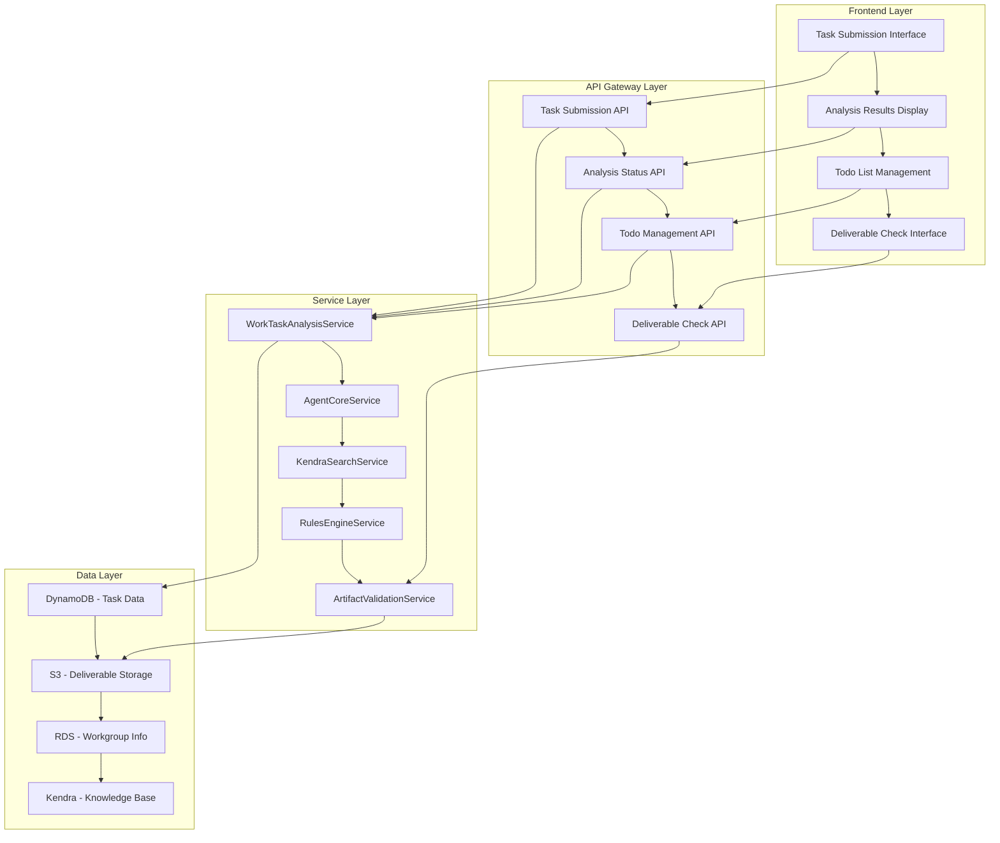
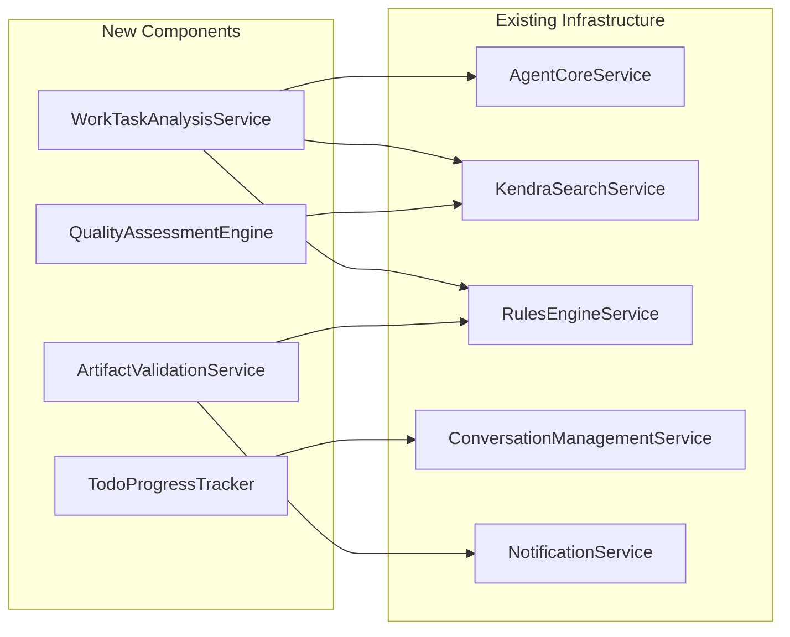

# Work Task Intelligent Analysis System Design Document

## Overview

The Work Task Intelligent Analysis System is a specialized functional module based on existing AI Agent infrastructure, designed to provide users with intelligent work task analysis services. The system receives user-submitted work task content through a frontend interface, utilizes backend AI agents for automatic analysis, searches project-specific knowledge bases, extracts key points, identifies related workgroups, generates structured todo lists, and performs quality checks and completion assessments on task deliverables.

The system adopts a microservices architecture, fully leveraging existing infrastructure such as AgentCore services, Kendra search services, and rules engines, implementing new functionality through extension and integration to ensure seamless integration with existing systems and efficient operation.

## Architecture Design

### High-Level Architecture



### System Integration Architecture



## Component Design

### Frontend Components

#### Task Submission Component (TaskSubmissionForm)

```typescript
interface TaskSubmissionFormProps {
  onSubmit: (task: TaskSubmissionRequest) => Promise<void>;
  loading?: boolean;
}

interface TaskSubmissionRequest {
  title: string;
  description: string;
  content: string;
  priority: 'low' | 'medium' | 'high' | 'critical';
  category?: string;
  tags?: string[];
  attachments?: File[];
}
```

**Key Features:**
- Rich text editor support for task content input
- File attachment upload functionality
- Task priority and category selection
- Tag system support
- Real-time content validation and hints

#### Analysis Result Display Component (AnalysisResultDisplay)

```typescript
interface AnalysisResultDisplayProps {
  analysisResult: TaskAnalysisResult;
  onUpdateTodo: (todoId: string, updates: TodoUpdateRequest) => Promise<void>;
  onSubmitDeliverable: (todoId: string, deliverable: File) => Promise<void>;
}
```

**Key Features:**
- Visual display of key points
- Interactive cards for related workgroups
- Editable todo lists
- Links and previews for knowledge base references
- Chart display for risk assessments

#### Todo List Management Component (TodoListManager)

```typescript
interface TodoListManagerProps {
  todos: TodoItem[];
  onStatusUpdate: (todoId: string, status: TodoStatus) => Promise<void>;
  onDeliverableSubmit: (todoId: string, deliverable: DeliverableSubmission) => Promise<void>;
  onQualityCheck: (todoId: string) => Promise<QualityAssessmentResult>;
}
```

**Key Features:**
- Drag-and-drop sorting and priority adjustment
- Progress tracking and status updates
- Deliverable upload and management
- Quality check result display
- Dependency relationship visualization

### Backend Service Components

#### Work Task Analysis Service (WorkTaskAnalysisService)

**Core Responsibilities:**
- Natural language processing and analysis of task content
- Key point extraction and structuring
- Related workgroup identification and recommendation
- Todo list generation and optimization
- Risk assessment and recommendation generation

**Main Methods:**

```typescript
class WorkTaskAnalysisService {
  async analyzeWorkTask(taskContent: WorkTaskContent): Promise<TaskAnalysisResult>
  async extractKeyPoints(content: string): Promise<KeyPoint[]>
  async identifyRelatedWorkgroups(content: string, keyPoints: KeyPoint[]): Promise<RelatedWorkgroup[]>
  async generateTodoList(content: string, keyPoints: KeyPoint[], knowledge: KnowledgeReference[]): Promise<TodoItem[]>
  async assessRisks(taskContent: WorkTaskContent, context: AnalysisContext): Promise<RiskAssessment>
  async generateRecommendations(analysisResult: TaskAnalysisResult): Promise<string[]>
}
```

#### Artifact Validation Service (ArtifactValidationService)

**Core Responsibilities:**
- Automated quality checking of deliverables
- Completion assessment and verification
- Technical specification compliance checking
- Quality scoring and improvement suggestions

**Main Methods:**

```typescript
class ArtifactValidationService {
  async validateDeliverable(todoId: string, deliverable: DeliverableFile): Promise<ValidationResult>
  async assessCompleteness(todoItem: TodoItem, deliverable: DeliverableFile): Promise<CompletenessAssessment>
  async performQualityCheck(deliverable: DeliverableFile, qualityStandards: QualityStandard[]): Promise<QualityAssessmentResult>
  async generateImprovementSuggestions(validationResult: ValidationResult): Promise<string[]>
}
```

#### Todo Progress Tracker Service (TodoProgressTracker)

**Core Responsibilities:**
- Real-time tracking of task progress
- Recording and notification of status changes
- Identification and early warning of blocking issues
- Statistical analysis of overall project progress

**Main Methods:**

```typescript
class TodoProgressTracker {
  async updateTodoStatus(todoId: string, status: TodoStatus, metadata: StatusMetadata): Promise<void>
  async trackProgress(taskId: string): Promise<ProgressSummary>
  async identifyBlockers(taskId: string): Promise<BlockerAnalysis[]>
  async generateProgressReport(taskId: string, timeRange: TimeRange): Promise<ProgressReport>
}
```

## Data Model Design

### DynamoDB Table Structure

#### work_tasks table

```typescript
interface WorkTaskRecord {
  task_id: string; // Partition Key
  created_at: string; // Sort Key
  title: string;
  description: string;
  content: string;
  submitted_by: string;
  team_id: string;
  priority: 'low' | 'medium' | 'high' | 'critical';
  category?: string;
  tags?: string[];
  status: 'submitted' | 'analyzing' | 'analyzed' | 'in_progress' | 'completed';
  analysis_result?: TaskAnalysisResult;
  updated_at: string;
  ttl?: number; // Data retention period
}
```

#### todo_items table

```typescript
interface TodoItemRecord {
  todo_id: string; // Partition Key
  task_id: string; // GSI Partition Key
  title: string;
  description: string;
  priority: 'low' | 'medium' | 'high' | 'critical';
  estimated_hours: number;
  assigned_to?: string;
  due_date?: string;
  dependencies: string[];
  category: 'research' | 'development' | 'review' | 'approval' | 'documentation' | 'testing';
  status: 'pending' | 'in_progress' | 'completed' | 'blocked';
  related_workgroups: string[];
  deliverables: DeliverableRecord[];
  quality_checks: QualityCheckRecord[];
  created_at: string;
  updated_at: string;
}
```

#### deliverables table

```typescript
interface DeliverableRecord {
  deliverable_id: string; // Partition Key
  todo_id: string; // GSI Partition Key
  file_name: string;
  file_type: string;
  file_size: number;
  s3_key: string;
  submitted_by: string;
  submitted_at: string;
  validation_result?: ValidationResult;
  quality_assessment?: QualityAssessmentResult;
  status: 'submitted' | 'validating' | 'approved' | 'rejected' | 'needs_revision';
}
```

### S3 Storage Structure

```
work-task-analysis-bucket/
├── tasks/
│   ├── {task_id}/
│   │   ├── original_content.json
│   │   ├── analysis_result.json
│   │   └── attachments/
│   │       ├── {attachment_id}.{ext}
│   │       └── ...
├── deliverables/
│   ├── {todo_id}/
│   │   ├── {deliverable_id}/
│   │   │   ├── original_file.{ext}
│   │   │   ├── validation_report.json
│   │   │   └── quality_assessment.json
├── reports/
│   ├── progress_reports/
│   │   └── {task_id}_{timestamp}.json
│   └── quality_reports/
│       └── {deliverable_id}_{timestamp}.json
```

## Interface Design

### REST API Endpoints

#### Task Management API

```typescript
// Submit work task
POST /api/v1/work-tasks
Request: TaskSubmissionRequest
Response: { taskId: string, status: string }

// Get task analysis results
GET /api/v1/work-tasks/{taskId}/analysis
Response: TaskAnalysisResult

// Get task list
GET /api/v1/work-tasks?teamId={teamId}&status={status}&limit={limit}&offset={offset}
Response: { tasks: WorkTaskSummary[], totalCount: number }

// Update task status
PUT /api/v1/work-tasks/{taskId}/status
Request: { status: string, notes?: string }
Response: { success: boolean }
```

#### Todo Management API

```typescript
// Get Todo list
GET /api/v1/work-tasks/{taskId}/todos
Response: TodoItem[]

// Update Todo status
PUT /api/v1/todos/{todoId}/status
Request: TodoUpdateRequest
Response: { success: boolean }

// Submit deliverable
POST /api/v1/todos/{todoId}/deliverables
Request: FormData (file + metadata)
Response: { deliverableId: string, validationStatus: string }

// Get Todo progress
GET /api/v1/work-tasks/{taskId}/progress
Response: ProgressSummary
```

#### Quality Check API

```typescript
// Execute quality check
POST /api/v1/deliverables/{deliverableId}/quality-check
Response: QualityAssessmentResult

// Get quality report
GET /api/v1/deliverables/{deliverableId}/quality-report
Response: QualityReport

// Batch quality check
POST /api/v1/work-tasks/{taskId}/batch-quality-check
Response: { results: QualityAssessmentResult[] }
```

### WebSocket Events

```typescript
// Task analysis progress update
interface AnalysisProgressEvent {
  type: 'analysis_progress';
  taskId: string;
  progress: number; // 0-100
  currentStep: string;
  estimatedTimeRemaining: number;
}

// Todo status change notification
interface TodoStatusChangeEvent {
  type: 'todo_status_change';
  todoId: string;
  taskId: string;
  oldStatus: TodoStatus;
  newStatus: TodoStatus;
  updatedBy: string;
  timestamp: string;
}

// Quality check completion notification
interface QualityCheckCompleteEvent {
  type: 'quality_check_complete';
  deliverableId: string;
  todoId: string;
  result: QualityAssessmentResult;
  timestamp: string;
}
```

## Error Handling and Exception Management

### Error Classification

```typescript
// Task analysis related errors
class TaskAnalysisError extends Error {
  constructor(
    public code: 'INVALID_CONTENT' | 'ANALYSIS_TIMEOUT' | 'KNOWLEDGE_SEARCH_FAILED',
    message: string,
    public taskId?: string
  ) {
    super(message);
  }
}

// Deliverable validation related errors
class DeliverableValidationError extends Error {
  constructor(
    public code: 'INVALID_FILE_TYPE' | 'FILE_TOO_LARGE' | 'VALIDATION_FAILED',
    message: string,
    public deliverableId?: string
  ) {
    super(message);
  }
}

// Quality assessment related errors
class QualityAssessmentError extends Error {
  constructor(
    public code: 'ASSESSMENT_FAILED' | 'STANDARDS_NOT_FOUND' | 'PROCESSING_ERROR',
    message: string,
    public deliverableId?: string
  ) {
    super(message);
  }
}
```

### Retry Strategy

```typescript
interface RetryConfiguration {
  maxAttempts: number;
  backoffMultiplier: number;
  maxBackoffTime: number;
  retryableErrors: string[];
}

const retryConfigs = {
  taskAnalysis: {
    maxAttempts: 3,
    backoffMultiplier: 2,
    maxBackoffTime: 30000,
    retryableErrors: ['KNOWLEDGE_SEARCH_FAILED', 'ANALYSIS_TIMEOUT']
  },
  qualityCheck: {
    maxAttempts: 2,
    backoffMultiplier: 1.5,
    maxBackoffTime: 15000,
    retryableErrors: ['PROCESSING_ERROR']
  }
};
```

## Testing Strategy

### Unit Testing

```typescript
// Work task analysis service tests
describe('WorkTaskAnalysisService', () => {
  test('should extract key points from task content', async () => {
    const service = new WorkTaskAnalysisService(mockDependencies);
    const keyPoints = await service.extractKeyPoints(mockTaskContent);
    expect(keyPoints).toHaveLength(5);
    expect(keyPoints[0]).toContain('need');
  });

  test('should identify related workgroups based on content', async () => {
    const service = new WorkTaskAnalysisService(mockDependencies);
    const workgroups = await service.identifyRelatedWorkgroups(mockTaskContent, mockKeyPoints);
    expect(workgroups).toContainEqual(expect.objectContaining({
      teamId: 'security-team',
      relevanceScore: expect.any(Number)
    }));
  });
});
```

### Integration Testing

```typescript
// End-to-end task analysis workflow tests
describe('Task Analysis Integration', () => {
  test('should complete full analysis workflow', async () => {
    // 1. Submit task
    const submitResponse = await request(app)
      .post('/api/v1/work-tasks')
      .send(mockTaskSubmission)
      .expect(201);

    // 2. Wait for analysis completion
    await waitForAnalysisCompletion(submitResponse.body.taskId);

    // 3. Verify analysis results
    const analysisResponse = await request(app)
      .get(`/api/v1/work-tasks/${submitResponse.body.taskId}/analysis`)
      .expect(200);

    expect(analysisResponse.body).toHaveProperty('keyPoints');
    expect(analysisResponse.body).toHaveProperty('todoList');
    expect(analysisResponse.body).toHaveProperty('relatedWorkgroups');
  });
});
```

### Performance Testing

```typescript
// Concurrent task analysis performance tests
describe('Performance Tests', () => {
  test('should handle 50 concurrent task analyses', async () => {
    const startTime = Date.now();
    const promises = Array.from({ length: 50 }, () => 
      analyzeTask(generateMockTask())
    );

    const results = await Promise.all(promises);
    const endTime = Date.now();

    expect(results).toHaveLength(50);
    expect(endTime - startTime).toBeLessThan(120000); // Complete within 2 minutes
    expect(results.every(r => r.success)).toBe(true);
  });
});
```

## Monitoring and Observability

### Key Metrics

```typescript
interface TaskAnalysisMetrics {
  // Business metrics
  tasksSubmittedPerHour: number;
  averageAnalysisTime: number;
  analysisSuccessRate: number;
  todoCompletionRate: number;
  qualityCheckPassRate: number;

  // Technical metrics
  apiResponseTime: number;
  errorRate: number;
  throughput: number;
  resourceUtilization: number;

  // User experience metrics
  userSatisfactionScore: number;
  featureUsageRate: number;
  taskResubmissionRate: number;
}
```

### Alert Rules

```typescript
const alertRules = {
  analysisFailureRate: {
    threshold: 0.05, // 5%
    window: '5m',
    severity: 'high'
  },
  averageAnalysisTime: {
    threshold: 180, // 3分钟
    window: '10m',
    severity: 'medium'
  },
  qualityCheckFailureRate: {
    threshold: 0.1, // 10%
    window: '15m',
    severity: 'medium'
  }
};
```

## Security Considerations

### Data Protection

- **Sensitive Information Detection**: PII detection and masking before task content analysis
- **Access Control**: Fine-grained permission control based on teams and roles
- **Data Encryption**: Static data encrypted with KMS, data in transit with TLS 1.3
- **Audit Logging**: Complete recording of all operations and data access

### Input Validation

```typescript
const inputValidationRules = {
  taskContent: {
    maxLength: 50000,
    allowedFileTypes: ['.txt', '.md', '.pdf', '.docx'],
    maxFileSize: 10 * 1024 * 1024, // 10MB
    sanitization: true
  },
  deliverables: {
    maxFileSize: 100 * 1024 * 1024, // 100MB
    virusScanRequired: true,
    contentTypeValidation: true
  }
};
```

## Performance Optimization

### Caching Strategy

```typescript
interface CacheConfiguration {
  analysisResults: {
    ttl: 3600; // 1 hour
    maxSize: 1000;
    evictionPolicy: 'LRU';
  };
  knowledgeSearchResults: {
    ttl: 1800; // 30 minutes
    maxSize: 5000;
    evictionPolicy: 'LRU';
  };
  workgroupMappings: {
    ttl: 86400; // 24 hours
    maxSize: 100;
    evictionPolicy: 'TTL';
  };
}
```

### Asynchronous Processing

```typescript
// Use Step Functions for asynchronous task analysis
const taskAnalysisWorkflow = {
  Comment: "Work Task Analysis Workflow",
  StartAt: "ValidateInput",
  States: {
    ValidateInput: {
      Type: "Task",
      Resource: "arn:aws:lambda:region:account:function:validateTaskInput",
      Next: "ExtractKeyPoints"
    },
    ExtractKeyPoints: {
      Type: "Task",
      Resource: "arn:aws:lambda:region:account:function:extractKeyPoints",
      Next: "SearchKnowledge"
    },
    SearchKnowledge: {
      Type: "Task",
      Resource: "arn:aws:lambda:region:account:function:searchKnowledge",
      Next: "IdentifyWorkgroups"
    },
    IdentifyWorkgroups: {
      Type: "Task",
      Resource: "arn:aws:lambda:region:account:function:identifyWorkgroups",
      Next: "GenerateTodos"
    },
    GenerateTodos: {
      Type: "Task",
      Resource: "arn:aws:lambda:region:account:function:generateTodos",
      Next: "AssessRisks"
    },
    AssessRisks: {
      Type: "Task",
      Resource: "arn:aws:lambda:region:account:function:assessRisks",
      Next: "CompileResults"
    },
    CompileResults: {
      Type: "Task",
      Resource: "arn:aws:lambda:region:account:function:compileResults",
      End: true
    }
  }
};
```

This design document provides a complete technical architecture for the Work Task Intelligent Analysis System, fully leveraging existing AI Agent infrastructure and implementing new functionality through extension and integration to ensure system scalability, maintainability, and high performance.