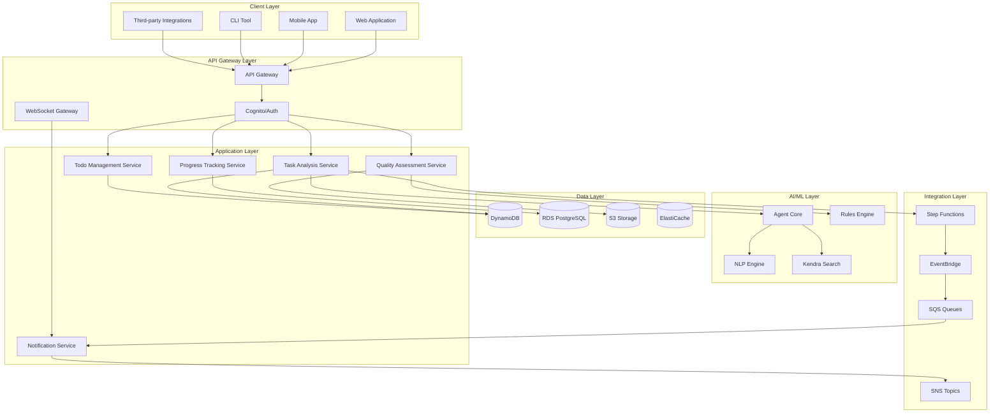
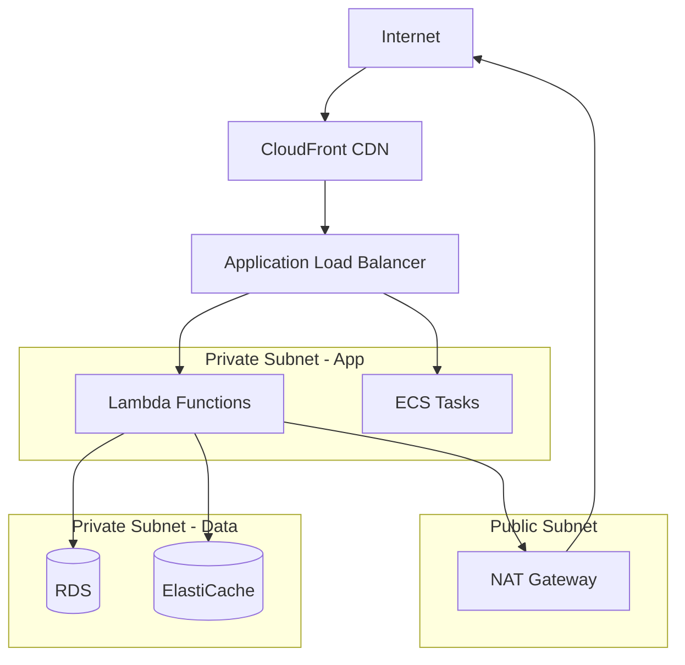

# Work Task Analysis System - Architecture Documentation

## Executive Summary

The Work Task Intelligent Analysis System is a cloud-native, microservices-based platform built on AWS infrastructure. It leverages AI/ML capabilities to automatically analyze work tasks, generate actionable todo lists, assess deliverable quality, and track project progress. The system is designed for high availability, scalability, and security.

## Table of Contents

- [System Overview](#system-overview)
- [Architecture Principles](#architecture-principles)
- [High-Level Architecture](#high-level-architecture)
- [Component Architecture](#component-architecture)
- [Data Architecture](#data-architecture)
- [Security Architecture](#security-architecture)
- [Deployment Architecture](#deployment-architecture)
- [Integration Architecture](#integration-architecture)
- [Scalability and Performance](#scalability-and-performance)
- [Technology Stack](#technology-stack)

---

## System Overview

### Purpose

The Work Task Analysis System provides intelligent automation for project management workflows by:
- Analyzing work task content using NLP and AI
- Extracting key points and identifying dependencies
- Recommending relevant workgroups and resources
- Generating structured, prioritized todo lists
- Assessing deliverable quality automatically
- Tracking progress and identifying blockers

### Key Capabilities

1. **Intelligent Task Analysis**: NLP-powered analysis of task descriptions
2. **Knowledge Base Integration**: Semantic search across project documentation
3. **Workgroup Identification**: ML-based team matching
4. **Todo Generation**: Automated breakdown of complex tasks
5. **Quality Assessment**: Rule-based and ML-powered quality checks
6. **Progress Tracking**: Real-time monitoring and reporting
7. **Real-time Updates**: WebSocket-based live notifications

---

## Architecture Principles

### 1. Microservices Architecture

The system is decomposed into loosely coupled, independently deployable services:
- Each service has a single responsibility
- Services communicate via well-defined APIs
- Services can be scaled independently
- Failures are isolated to individual services

### 2. Event-Driven Design

Asynchronous processing using event-driven patterns:
- Decouples producers from consumers
- Enables parallel processing
- Improves system resilience
- Facilitates audit logging

### 3. Cloud-Native

Built specifically for cloud deployment:
- Leverages managed AWS services
- Auto-scaling based on demand
- Multi-region deployment capability
- Infrastructure as Code (IaC)

### 4. Security by Design

Security integrated at every layer:
- Zero-trust security model
- Encryption at rest and in transit
- Fine-grained access control
- Comprehensive audit logging

### 5. API-First

All functionality exposed via APIs:
- RESTful API design
- OpenAPI specification
- Versioned endpoints
- Comprehensive documentation

---

## High-Level Architecture



---

## Component Architecture

### Frontend Components

#### Web Application
- **Technology**: React 18, TypeScript, Vite
- **State Management**: React Context + Hooks
- **UI Framework**: Tailwind CSS
- **Real-time**: WebSocket client
- **Build**: Vite bundler
- **Deployment**: S3 + CloudFront

**Key Features**:
- Responsive design
- Progressive Web App (PWA)
- Offline capability
- Real-time updates
- Accessibility compliant (WCAG 2.1 AA)

#### Component Structure
```
frontend/
├── src/
│   ├── components/
│   │   ├── TaskSubmission/
│   │   │   ├── TaskSubmissionForm.tsx
│   │   │   ├── FileUpload.tsx
│   │   │   └── PrioritySelector.tsx
│   │   ├── Analysis/
│   │   │   ├── AnalysisResults.tsx
│   │   │   ├── KeyPointsDisplay.tsx
│   │   │   └── WorkgroupCards.tsx
│   │   ├── TodoManagement/
│   │   │   ├── TodoList.tsx
│   │   │   ├── TodoItem.tsx
│   │   │   └── DependencyGraph.tsx
│   │   └── Quality/
│   │       ├── QualityDashboard.tsx
│   │       ├── QualityScore.tsx
│   │       └── ImprovementSuggestions.tsx
│   ├── services/
│   │   ├── api.ts
│   │   ├── websocket.ts
│   │   └── auth.ts
│   ├── hooks/
│   │   ├── useTask.ts
│   │   ├── useTodos.ts
│   │   └── useWebSocket.ts
│   └── utils/
│       ├── validation.ts
│       └── formatting.ts
```

### Backend Services

#### Task Analysis Service
**Responsibility**: Analyze work task content and generate insights

**Components**:
```typescript
class WorkTaskAnalysisService {
  // Core analysis methods
  async analyzeWorkTask(content: WorkTaskContent): Promise<TaskAnalysisResult>
  async extractKeyPoints(content: string): Promise<KeyPoint[]>
  async identifyRelatedWorkgroups(content: string): Promise<RelatedWorkgroup[]>
  async generateTodoList(content: string): Promise<TodoItem[]>
  async assessRisks(content: WorkTaskContent): Promise<RiskAssessment>
}
```

**Dependencies**:
- Agent Core Service (NLP processing)
- Kendra Search Service (knowledge retrieval)
- DynamoDB (data persistence)
- Step Functions (workflow orchestration)

**Deployment**:
- Lambda functions (Node.js 20)
- Memory: 2048 MB
- Timeout: 180 seconds
- Concurrency: 100

#### Todo Management Service
**Responsibility**: Manage todo items and track status

**Components**:
```typescript
class TodoManagementService {
  async createTodo(todo: TodoItem): Promise<string>
  async updateTodoStatus(todoId: string, status: TodoStatus): Promise<void>
  async getTodos(taskId: string): Promise<TodoItem[]>
  async assignTodo(todoId: string, userId: string): Promise<void>
  async submitDeliverable(todoId: string, file: File): Promise<string>
}
```

**Dependencies**:
- DynamoDB (todo storage)
- S3 (deliverable storage)
- EventBridge (status change events)
- SNS (notifications)

#### Quality Assessment Service
**Responsibility**: Evaluate deliverable quality

**Components**:
```typescript
class QualityAssessmentService {
  async assessQuality(deliverable: Deliverable): Promise<QualityResult>
  async validateDeliverable(deliverable: Deliverable): Promise<ValidationResult>
  async generateImprovementSuggestions(result: QualityResult): Promise<string[]>
  async batchAssess(deliverables: Deliverable[]): Promise<QualityResult[]>
}
```

**Dependencies**:
- Rules Engine (quality rules)
- S3 (deliverable access)
- Lambda (processing)
- DynamoDB (results storage)

#### Progress Tracking Service
**Responsibility**: Monitor and report on task progress

**Components**:
```typescript
class ProgressTrackingService {
  async getTaskProgress(taskId: string): Promise<ProgressSummary>
  async identifyBlockers(taskId: string): Promise<Blocker[]>
  async generateProgressReport(taskId: string): Promise<ProgressReport>
  async trackMetrics(taskId: string): Promise<Metrics>
}
```

**Dependencies**:
- RDS PostgreSQL (time-series data)
- DynamoDB (task data)
- CloudWatch (metrics)
- QuickSight (reporting)

---

## Data Architecture

### Data Storage Strategy

#### DynamoDB Tables

**work_tasks**
```
Partition Key: task_id (String)
Sort Key: created_at (String)
Attributes:
  - title, description, content
  - submitted_by, team_id
  - priority, category, tags
  - status, analysis_result
  - updated_at, ttl

GSI: team_id-status-index
  - Partition Key: team_id
  - Sort Key: status
  - Projection: ALL

GSI: status-created_at-index
  - Partition Key: status
  - Sort Key: created_at
  - Projection: ALL
```

**todo_items**
```
Partition Key: todo_id (String)
Sort Key: created_at (String)
Attributes:
  - task_id, title, description
  - priority, estimated_hours
  - assigned_to, due_date
  - dependencies, category
  - status, deliverables
  - updated_at

GSI: task_id-status-index
  - Partition Key: task_id
  - Sort Key: status
  - Projection: ALL

GSI: assigned_to-status-index
  - Partition Key: assigned_to
  - Sort Key: status
  - Projection: ALL
```

**deliverables**
```
Partition Key: deliverable_id (String)
Sort Key: submitted_at (String)
Attributes:
  - todo_id, task_id
  - file_name, file_type, file_size
  - s3_key, submitted_by
  - validation_result
  - quality_assessment
  - status

GSI: todo_id-status-index
  - Partition Key: todo_id
  - Sort Key: status
  - Projection: ALL
```

#### RDS PostgreSQL

**Time-Series Data**:
```sql
CREATE TABLE task_metrics (
  id SERIAL PRIMARY KEY,
  task_id VARCHAR(255) NOT NULL,
  metric_name VARCHAR(100) NOT NULL,
  metric_value DECIMAL(10,2),
  recorded_at TIMESTAMP NOT NULL,
  metadata JSONB,
  INDEX idx_task_metrics_task_id (task_id),
  INDEX idx_task_metrics_recorded_at (recorded_at)
);

CREATE TABLE progress_snapshots (
  id SERIAL PRIMARY KEY,
  task_id VARCHAR(255) NOT NULL,
  snapshot_time TIMESTAMP NOT NULL,
  total_todos INTEGER,
  completed_todos INTEGER,
  in_progress_todos INTEGER,
  blocked_todos INTEGER,
  overall_progress DECIMAL(5,2),
  INDEX idx_progress_task_id (task_id),
  INDEX idx_progress_snapshot_time (snapshot_time)
);
```

**Workgroup Data**:
```sql
CREATE TABLE workgroups (
  workgroup_id VARCHAR(255) PRIMARY KEY,
  name VARCHAR(255) NOT NULL,
  description TEXT,
  expertise JSONB,
  members JSONB,
  contact_info JSONB,
  created_at TIMESTAMP DEFAULT CURRENT_TIMESTAMP,
  updated_at TIMESTAMP DEFAULT CURRENT_TIMESTAMP
);

CREATE TABLE skill_matrix (
  id SERIAL PRIMARY KEY,
  workgroup_id VARCHAR(255) REFERENCES workgroups(workgroup_id),
  skill_name VARCHAR(255) NOT NULL,
  proficiency_level INTEGER CHECK (proficiency_level BETWEEN 1 AND 5),
  INDEX idx_skill_matrix_workgroup (workgroup_id),
  INDEX idx_skill_matrix_skill (skill_name)
);
```

#### S3 Storage Structure

```
work-task-analysis-bucket/
├── tasks/
│   └── {task_id}/
│       ├── original_content.json
│       ├── analysis_result.json
│       └── attachments/
│           └── {attachment_id}.{ext}
├── deliverables/
│   └── {todo_id}/
│       └── {deliverable_id}/
│           ├── original_file.{ext}
│           ├── validation_report.json
│           └── quality_assessment.json
├── reports/
│   ├── progress/
│   │   └── {task_id}_{timestamp}.pdf
│   └── quality/
│       └── {deliverable_id}_{timestamp}.pdf
└── exports/
    └── {export_id}/
        └── data.{format}
```

**S3 Configuration**:
- Versioning: Enabled
- Encryption: AES-256 (SSE-S3)
- Lifecycle: 90 days to Glacier, 365 days deletion
- Access Logging: Enabled
- CORS: Configured for web uploads

#### ElastiCache (Redis)

**Caching Strategy**:
```
Cache Keys:
- task:{task_id} -> Task details (TTL: 5 minutes)
- analysis:{task_id} -> Analysis results (TTL: 1 hour)
- todos:{task_id} -> Todo list (TTL: 5 minutes)
- workgroups:{skill} -> Workgroup matches (TTL: 1 day)
- user:{user_id}:tasks -> User's tasks (TTL: 5 minutes)
```

**Cache Invalidation**:
- On task update: Invalidate task:{task_id}
- On todo update: Invalidate todos:{task_id}
- On analysis complete: Invalidate analysis:{task_id}

---

## Security Architecture

### Authentication and Authorization

#### AWS Cognito Integration
```
User Pool Configuration:
- MFA: Optional (TOTP)
- Password Policy: 
  - Minimum length: 12 characters
  - Require uppercase, lowercase, numbers, symbols
  - Password history: 5
- Account Recovery: Email verification
- Token Expiration:
  - Access Token: 1 hour
  - Refresh Token: 30 days
```

#### IAM Roles and Policies

**Lambda Execution Role**:
```json
{
  "Version": "2012-10-17",
  "Statement": [
    {
      "Effect": "Allow",
      "Action": [
        "dynamodb:GetItem",
        "dynamodb:PutItem",
        "dynamodb:UpdateItem",
        "dynamodb:Query"
      ],
      "Resource": [
        "arn:aws:dynamodb:*:*:table/work_tasks",
        "arn:aws:dynamodb:*:*:table/todo_items"
      ]
    },
    {
      "Effect": "Allow",
      "Action": [
        "s3:GetObject",
        "s3:PutObject"
      ],
      "Resource": "arn:aws:s3:::work-task-bucket/*"
    },
    {
      "Effect": "Allow",
      "Action": [
        "kendra:Query"
      ],
      "Resource": "arn:aws:kendra:*:*:index/*"
    }
  ]
}
```

### Data Encryption

**At Rest**:
- DynamoDB: AWS managed keys (KMS)
- S3: SSE-S3 (AES-256)
- RDS: KMS encryption
- EBS: KMS encryption

**In Transit**:
- TLS 1.3 for all API communications
- Certificate management via ACM
- HTTPS only (HTTP redirects to HTTPS)

### Network Security



**Security Groups**:
- ALB: Inbound 443 from 0.0.0.0/0
- Lambda: Outbound to RDS, ElastiCache, NAT
- RDS: Inbound 5432 from Lambda SG
- ElastiCache: Inbound 6379 from Lambda SG

### Compliance and Audit

**Audit Logging**:
- CloudTrail: All API calls
- CloudWatch Logs: Application logs
- VPC Flow Logs: Network traffic
- S3 Access Logs: Object access

**Compliance**:
- GDPR: Data encryption, right to deletion
- SOC 2: Access controls, audit logging
- HIPAA: Encryption, access controls (if applicable)

---

## Deployment Architecture

### Multi-Region Deployment

```
Primary Region: us-east-1
Secondary Region: us-west-2

Replication:
- DynamoDB: Global Tables
- S3: Cross-region replication
- RDS: Read replicas
```

### CI/CD Pipeline

```mermaid
graph LR
    Code[Code Repository] --> Build[Build Stage]
    Build --> Test[Test Stage]
    Test --> Security[Security Scan]
    Security --> Deploy[Deploy to Dev]
    Deploy --> Integration[Integration Tests]
    Integration --> Staging[Deploy to Staging]
    Staging --> Approval[Manual Approval]
    Approval --> Production[Deploy to Production]
```



**Pipeline Stages**:
1. **Build**: Compile TypeScript, bundle frontend
2. **Test**: Unit tests, integration tests
3. **Security**: SAST, dependency scanning
4. **Deploy Dev**: Automated deployment
5. **Integration Tests**: E2E tests
6. **Deploy Staging**: Automated deployment
7. **Manual Approval**: Product owner approval
8. **Deploy Production**: Blue-green deployment

### Infrastructure as Code

**AWS CDK Stack**:
```typescript
export class WorkTaskAnalysisStack extends Stack {
  constructor(scope: Construct, id: string, props?: StackProps) {
    super(scope, id, props);

    // VPC
    const vpc = new ec2.Vpc(this, 'WorkTaskVPC', {
      maxAzs: 3,
      natGateways: 2,
    });

    // DynamoDB Tables
    const tasksTable = new dynamodb.Table(this, 'WorkTasksTable', {
      partitionKey: { name: 'task_id', type: dynamodb.AttributeType.STRING },
      sortKey: { name: 'created_at', type: dynamodb.AttributeType.STRING },
      billingMode: dynamodb.BillingMode.PAY_PER_REQUEST,
      pointInTimeRecovery: true,
      encryption: dynamodb.TableEncryption.AWS_MANAGED,
    });

    // Lambda Functions
    const taskAnalysisFunction = new lambda.Function(this, 'TaskAnalysis', {
      runtime: lambda.Runtime.NODEJS_20_X,
      handler: 'index.handler',
      code: lambda.Code.fromAsset('dist/task-analysis'),
      memorySize: 2048,
      timeout: Duration.seconds(180),
      vpc,
      environment: {
        TASKS_TABLE: tasksTable.tableName,
      },
    });

    // API Gateway
    const api = new apigateway.RestApi(this, 'WorkTaskAPI', {
      restApiName: 'Work Task Analysis API',
      deployOptions: {
        stageName: 'prod',
        tracingEnabled: true,
      },
    });

    // CloudFront Distribution
    const distribution = new cloudfront.Distribution(this, 'WebDistribution', {
      defaultBehavior: {
        origin: new origins.S3Origin(websiteBucket),
        viewerProtocolPolicy: cloudfront.ViewerProtocolPolicy.REDIRECT_TO_HTTPS,
      },
    });
  }
}
```

---

## Integration Architecture

### External Integrations

#### Slack Integration
```typescript
class SlackNotificationService {
  async sendNotification(event: NotificationEvent) {
    const message = this.formatSlackMessage(event);
    await this.slackClient.chat.postMessage({
      channel: event.channel,
      text: message.text,
      blocks: message.blocks,
    });
  }
}
```

#### Microsoft Teams Integration
```typescript
class TeamsNotificationService {
  async sendNotification(event: NotificationEvent) {
    const card = this.createAdaptiveCard(event);
    await this.teamsClient.sendMessage(event.webhookUrl, card);
  }
}
```

#### Jira Integration
```typescript
class JiraIntegrationService {
  async createIssue(todo: TodoItem) {
    return await this.jiraClient.issues.createIssue({
      fields: {
        project: { key: 'PROJ' },
        summary: todo.title,
        description: todo.description,
        issuetype: { name: 'Task' },
      },
    });
  }
}
```

### Webhook Support

```typescript
interface WebhookConfig {
  url: string;
  events: string[];
  secret: string;
  retryPolicy: {
    maxRetries: number;
    backoffMultiplier: number;
  };
}

class WebhookService {
  async deliverWebhook(event: Event, config: WebhookConfig) {
    const payload = this.createPayload(event);
    const signature = this.signPayload(payload, config.secret);
    
    await this.httpClient.post(config.url, payload, {
      headers: {
        'X-Webhook-Signature': signature,
        'X-Webhook-Event': event.type,
      },
    });
  }
}
```

---

## Scalability and Performance

### Auto-Scaling Configuration

**Lambda**:
- Concurrent executions: 1000
- Reserved concurrency: 100 per function
- Provisioned concurrency: 10 for critical functions

**DynamoDB**:
- On-demand billing mode
- Auto-scaling for provisioned mode:
  - Target utilization: 70%
  - Min capacity: 5
  - Max capacity: 1000

**RDS**:
- Instance type: db.r6g.xlarge
- Read replicas: 2
- Auto-scaling storage: Enabled
- Max storage: 1 TB

### Performance Optimization

**Caching Strategy**:
1. CloudFront: Static assets (TTL: 1 day)
2. API Gateway: Response caching (TTL: 5 minutes)
3. ElastiCache: Application data (TTL: varies)
4. DynamoDB DAX: Database queries (TTL: 5 minutes)

**Query Optimization**:
- DynamoDB: Use GSIs for common queries
- RDS: Indexed columns, query optimization
- Kendra: Filtered searches, result limiting

**Async Processing**:
- Step Functions: Long-running workflows
- SQS: Message queuing
- EventBridge: Event routing

---

## Technology Stack

### Frontend
- React 18.2
- TypeScript 5.0
- Vite 5.0
- Tailwind CSS 3.4
- React Query 5.0
- WebSocket Client

### Backend
- Node.js 20.x
- TypeScript 5.0
- Express 4.18
- AWS SDK v3
- Jest 29.0 (testing)

### Infrastructure
- AWS Lambda
- API Gateway
- DynamoDB
- RDS PostgreSQL 15
- S3
- CloudFront
- Cognito
- Kendra
- Step Functions
- EventBridge
- SQS/SNS
- ElastiCache Redis

### DevOps
- AWS CDK 2.x
- GitHub Actions
- Docker
- AWS CodePipeline
- CloudWatch
- X-Ray

---

## Appendix

### Architecture Decision Records (ADRs)

**ADR-001: Use DynamoDB for Task Storage**
- Decision: Use DynamoDB instead of RDS for task and todo storage
- Rationale: Better scalability, lower latency, pay-per-request pricing
- Trade-offs: Limited query flexibility, eventual consistency

**ADR-002: Serverless Architecture**
- Decision: Use Lambda functions instead of EC2/ECS
- Rationale: Lower operational overhead, automatic scaling, cost efficiency
- Trade-offs: Cold start latency, execution time limits

**ADR-003: Step Functions for Workflows**
- Decision: Use Step Functions for task analysis workflow
- Rationale: Visual workflow, built-in error handling, state management
- Trade-offs: Additional cost, learning curve

---

**Document Version**: 1.0
**Last Updated**: January 5, 2025
**Maintained By**: Architecture Team
